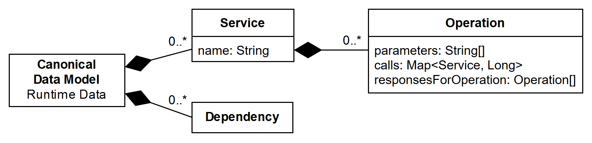

# Runtime Calculator for Service-Based Maintainability Metrics

[](https://github.com/xJREB/microservices-runtime-analysis/actions)
[](https://sonarcloud.io/dashboard?id=xJREB_microservices-runtime-analysis)
[](https://sonarcloud.io/dashboard?id=xJREB_microservices-runtime-analysis)
[](https://sonarcloud.io/dashboard?id=xJREB_microservices-runtime-analysis)
[](https://sonarcloud.io/dashboard?id=xJREB_microservices-runtime-analysis)

This Java CLI application uses operational data produced by service- or microservice-based systems for the calculation of service-based maintainability metrics. It collects runtime data by using integrators (e.g. via OpenTracing), calculates maintainability metrics, and uses exporters to output the results (e.g. as a JSON file).

## Usage Instructions

```bash
# build the executable JAR
mvn clean install

# display a list of possible parameters
java -jar target/ms-runtime-analysis-1.0.1.jar --help
usage: Microservices Maintainability Analysis via Runtime Data
 -h,--help                       Show help
 -d,--debug                      Enable debug output
 -sd,--start_date <arg>          (Required) Start date for the analysis,
                                 yyyy/MM/dd HH:mm:ss or unix timestamp in
                                 ms
 -ed,--end_date <arg>            (Optional) End date for the analysis,
                                 yyyy/MM/dd HH:mm:ss or unix timestamp in
                                 ms, defaults to now
 -i,--integrators <arg>          (Required) Integrators to be used,
                                 delimited with commas
 -ip,--integrator_params <arg>   (Optional) Parameters for the
                                 integrators, space-delimited
                                 integrator:key=value elements
 -e,--exporters <arg>            (Required) Exporters to be used,
                                 delimited with commas
 -ep,--exporter_params <arg>     (Optional) Parameters for the exporters,
                                 space-delimited exporter:key=value
                                 elements

# example run with a local Zipkin instance with collected runtime data
java -jar target/ms-runtime-analysis-1.0.1.jar \
    --start_date "2019/01/01 00:00:00" \
    --end_date "now" \
    --integrators "zipkin" \
    --integrator_params "zipkin:url=http://localhost:9411" \
    --exporters="xml,json,csv,human_readable,markdown" \
    --exporter_params "xml:filename=results-examples/metrics.xml" \
                    "json:filename=results-examples/metrics.json" \
                    "csv:filename=results-examples/metrics.csv" \
                    "human_readable:filename=results-examples/metrics.txt" \
                    "markdown:filename=results-examples/metrics.md"
```

## Framework Architecture


The framework is developed to be easily extensible. New integrators, metrics and exporters can be added to support additional data sources, maintainability metrics, and result formats.

## Currently Implemented Modules

### Integrators

- [zipkin](src/main/java/de/uni_stuttgart/iste/ms_runtime_analysis/integrators/zipkin.java)

### Metrics

Each metric class includes a short description and a publication reference as a comment at the top.

- [Number of Services Involved in the Compound Service (NSIC)](src/main/java/de/uni_stuttgart/iste/ms_runtime_analysis/metrics/_000_NSIC.java)
- [Services Interdependence in the System (SIY)](src/main/java/de/uni_stuttgart/iste/ms_runtime_analysis/metrics/_001_SIY.java)
- [Absolute Importance of the Service (AIS)](src/main/java/de/uni_stuttgart/iste/ms_runtime_analysis/metrics/_002_AIS.java)
- [Absolute Dependence of the Service (ADS)](src/main/java/de/uni_stuttgart/iste/ms_runtime_analysis/metrics/_003_ADS.java)
- [Absolute Criticality of the Service (ACS)](src/main/java/de/uni_stuttgart/iste/ms_runtime_analysis/metrics/_004_ACS.java)
- [Number of Services (NS)](src/main/java/de/uni_stuttgart/iste/ms_runtime_analysis/metrics/_005_NS.java)
- [Relative Coupling of Service (RCS)](src/main/java/de/uni_stuttgart/iste/ms_runtime_analysis/metrics/_006_RCS.java)
- [Relative Importance of Service (RIS)](src/main/java/de/uni_stuttgart/iste/ms_runtime_analysis/metrics/_007_RIS.java)
- [Service Coupling Factor (SCF)](src/main/java/de/uni_stuttgart/iste/ms_runtime_analysis/metrics/_008_SCF.java)
- [Weighted Service Interface Count (WSIC)](src/main/java/de/uni_stuttgart/iste/ms_runtime_analysis/metrics/_009_WSIC.java)
- [Service Composition Pattern (SCP)](src/main/java/de/uni_stuttgart/iste/ms_runtime_analysis/metrics/_010_SCP.java)
- [Inverse of Average Number of Used Message (IAUM)](src/main/java/de/uni_stuttgart/iste/ms_runtime_analysis/metrics/_011_IAUM.java)
- [Service Interface Usage Cohesion (SIUC)](src/main/java/de/uni_stuttgart/iste/ms_runtime_analysis/metrics/_012_SIUC.java)
- [Service Interface Data Cohesion (SIDC)](src/main/java/de/uni_stuttgart/iste/ms_runtime_analysis/metrics/_013_SIDC.java)
- [Response for Operation (RFO)](src/main/java/de/uni_stuttgart/iste/ms_runtime_analysis/metrics/_014_RFO.java)
- [Total Response for Service (TRS)](src/main/java/de/uni_stuttgart/iste/ms_runtime_analysis/metrics/_015_TRS.java)
- [Mean Absolute Importance/Dependence in the System (MAIDS)](src/main/java/de/uni_stuttgart/iste/ms_runtime_analysis/metrics/_016_MAIDS.java)
- [Mean Absolute Coupling in the System (MACS)](src/main/java/de/uni_stuttgart/iste/ms_runtime_analysis/metrics/_017_MACS.java)
- [Dynamic Relative Dependence of Service (DRDS)](src/main/java/de/uni_stuttgart/iste/ms_runtime_analysis/metrics/_018_DRDS.java)
- [Dynamic Relative Importance of Service (DRIS)](src/main/java/de/uni_stuttgart/iste/ms_runtime_analysis/metrics/_019_DRIS.java)
- [Dynamic Relative Dependence of Service in the System (DRDSS)](src/main/java/de/uni_stuttgart/iste/ms_runtime_analysis/metrics/_020_DRDSS.java)
- [Dynamic Relative Importance of Service in the System (DRISS)](src/main/java/de/uni_stuttgart/iste/ms_runtime_analysis/metrics/_021_DRISS.java)
- [Cyclic Service Dependencies (CSD)](src/main/java/de/uni_stuttgart/iste/ms_runtime_analysis/metrics/_022_CSD.java)

### Exporters

- [xml](src/main/java/de/uni_stuttgart/iste/ms_runtime_analysis/exporters/xml.java)
- [json](src/main/java/de/uni_stuttgart/iste/ms_runtime_analysis/exporters/json.java)
- [csv](src/main/java/de/uni_stuttgart/iste/ms_runtime_analysis/exporters/csv.java)
- [human_readable](src/main/java/de/uni_stuttgart/iste/ms_runtime_analysis/exporters/human_readable.java)
- [markdown](src/main/java/de/uni_stuttgart/iste/ms_runtime_analysis/exporters/markdown.java)

## Using the Zipkin Integrator

A Zipkin server is required to collect runtime data using the Zipkin integrator. No special configuration for this Zipkin server is needed. To start a local Zipkin server instance via Docker, use the following command:

```bash
docker run -d -p 9411:9411 openzipkin/zipkin
```

The web interface can then be reached at <http://localhost:9411>. The system to be monitored has to be extended with tracing code to send runtime data to the Zipkin server. A wide variety of libraries for many programming languages and frameworks is available (see <https://zipkin.apache.org/pages/tracers_instrumentation.html>).

## Installation of an Example Microservice System with Zipkin Integration

The framework has been tested with a microservice-based microblogging system available at <https://github.com/senecajs/ramanujan>. This example system already includes the required modifications for the Zipkin integration, which simply need to be commented in. For an example, see [api/api-service.js, line 38](https://github.com/senecajs/ramanujan/blob/master/api/api-service.js#L38).

To run this application, use the following commands:

```bash
git clone https://github.com/senecajs/ramanujan.git
cd ramanujan/
find . -type f -print0 | xargs -0 sed -i 's/\/\/.use(\x27zipkin-tracer\x27, {sampling:1})/.use(\x27zipkin-tracer\x27, {sampling:1})/g'
npm install
./start.sh
```

To run the application via Docker, use these commands (doesn't work on all platforms):

```bash
git clone https://github.com/senecajs/ramanujan.git
cd ramanujan/
find . -type f -print0 | xargs -0 sed -i 's/\/\/.use(\x27zipkin-tracer\x27, {sampling:1})/.use(\x27zipkin-tracer\x27, {sampling:1})/g'
cd docker/
make
docker stack deploy -c ramanujan.yml ramanujan
```

For more information, see <https://github.com/senecajs/ramanujan>. Exemplary metric results from our case study with this system can found in the `results-examples` directory.

## How to Build a New Integrator to Support Additional Data Sources

Integrators produce a single common canonical graph representing the collected runtime data of a user-defined time span. The canonical runtime data model has the following format:



The integrators are run sequentially and change/extend the previous graph.

To create another integrator, follow these steps:

- Create a new Java class in the `integrators` package.
- The class has to implement the `IntegratorInterface` interface:

```java
public class NewIntegrator implements IntegratorInterface {
    ...
}
```

The interface contains just one method to implement:

```java
public DefaultDirectedGraph<Service, DefaultEdge> integrateRuntimeData(Configuration configuration, Map params, DefaultDirectedGraph<Service, DefaultEdge> graph) {
    ...
}
```

**Input Parameters:**

- `Configuration configuration`: contains application configuration parameters, like the start and end date of the analysis
- `Map params`: contains the parameters for just this integrator, like the url to the data source
- `DefaultDirectedGraph<Service, DefaultEdge>` graph: contains the Graph representing the collected runtime data of previous integrators

**Returns:**<br>
`DefaultDirectedGraph<Service, DefaultEdge>`: the changed/extended graph representing the collected runtime data of this and previous integrators

To use the newly created integrator, specify its class name as the value for the `--integrators` application parameter and optionally add parameters needed by this integrator to `--integrator_params` (see [Usage Instructions](#usage-instructions)).

## How to Build a New Metric Module

To add another metric to the framework, follow these steps:

- Create a new Java class in the `metrics` package.
- The class has to implement the `MetricInterface` interface:

```java
public class NewMetric implements MetricInterface {
    ...
}
```

The interface contains just one method that needs to be implemented:

```java
public Metric calculateMetric(DefaultDirectedGraph<Service, DefaultEdge> graph) {
    ...
}
```

**Input Parameters:**<br>
`DefaultDirectedGraph<Service, DefaultEdge> graph`: the graph representing the collected runtime data of the integrators

**Returns:**<br>
`Metric`: a metric object containing attributes of the metric like name and description as well as the calculated result(s). The data model for metric objects is as follows:


- `longName`: name of the metric
- `abbreviation`: abbreviation of the metric
- `description`: text describing the metric
- `interpretation`: text describing how to interpret the results and the range of the possible result values
- `resultStatus`: an integer specifying if there was an error during the calculation (`0`) or if the calculation was successful with a single result (`1`), multiple results (`2`), or nested results (`3`).
- `resultStatusMessage`: contains the error message if there was an error during calculation, otherwise empty
- `result`: one of the following result types
  - Single result
  - Multiple results, each one mapping a key to a value
  - Nested results, each one mapping a key to a list of maps mapping a key to a value
- `resultDetails`: contains additional details for the calculated metric, e.g. identified cycles in the metric `Cyclic Service Dependencies (CSD)`

Each metric implemented in this way will be automatically used in the analysis.

## How to Build a New Exporter to Support Additional Result Formats

The exporters output the calculated metrics to an arbitrary target in an arbitrary format. There can be as many exporters as needed. For the canonical results data model, see the [above section](#how-to-build-a-new-metric-module) on how to build a new metric module.

To create another exporter follow these steps:

- Create a new Java class in the `exporters` package.
- The class has to implement the `ExporterInterface` interface:

```java
public class NewExporter implements ExporterInterface {
    ...
}
```

The interface contains just one method to implement:

```java
public Boolean exportResults(Configuration configuration, Map params, ArrayList<Metric> metrics) {
    ...
}
```

**Input Parameters:**

- `Configuration configuration`: contains application configuration parameters, like the start and end date of the analysis
- `Map params`: contains the parameters for just this exporter, like the target filename
- `ArrayList<Metric> metrics`: a list containing the calculated metrics and their attributes

**Returns:**<br>
Returns `true` if the export was successful, otherwise `false`

To use the newly created exporter, specify its class name as the value for the `--exporters` application parameter and optionally add parameters needed by this exporter to `--exporter_params` (see [Usage Instructions](#usage-instructions)).

## XML Schema Definition (XSD) for the XML Exporter

```xml
<?xml version="1.0" encoding="UTF-8"?>
<xs:schema xmlns:xs="http://www.w3.org/2001/XMLSchema" elementFormDefault="qualified">
  <xs:element name="metrics">
    <xs:complexType>
      <xs:sequence>
        <xs:element maxOccurs="unbounded" ref="metric"/>
      </xs:sequence>
    </xs:complexType>
  </xs:element>
  <xs:element name="metric">
    <xs:complexType>
      <xs:sequence>
        <xs:element name="name" type="xs:string"/>
        <xs:element name="abbreviation" type="xs:string"/>
        <xs:element name="description" type="xs:string"/>
        <xs:element name="interpretation" type="xs:string"/>
        <xs:choice>
          <xs:element ref="result"/>
          <xs:element ref="results"/>
        </xs:choice>
        <xs:element minOccurs="0" ref="details"/>
      </xs:sequence>
    </xs:complexType>
  </xs:element>
  <xs:element name="result">
    <xs:complexType mixed="true">
      <xs:choice minOccurs="0" maxOccurs="unbounded">
        <xs:element name="name" type="xs:string"/>
        <xs:element name="value" type="xs:decimal"/>
        <xs:element ref="subresult"/>
      </xs:choice>
    </xs:complexType>
  </xs:element>
  <xs:element name="subresult">
    <xs:complexType>
      <xs:sequence>
        <xs:element name="name" type="xs:string"/>
        <xs:element name="value" type="xs:decimal"/>
      </xs:sequence>
    </xs:complexType>
  </xs:element>
  <xs:element name="results">
    <xs:complexType>
      <xs:sequence>
        <xs:element maxOccurs="unbounded" ref="result"/>
      </xs:sequence>
    </xs:complexType>
  </xs:element>
  <xs:element name="details">
    <xs:complexType>
      <xs:sequence>
        <xs:element maxOccurs="unbounded" name="detail" type="xs:string"/>
      </xs:sequence>
    </xs:complexType>
  </xs:element>
</xs:schema>
```
